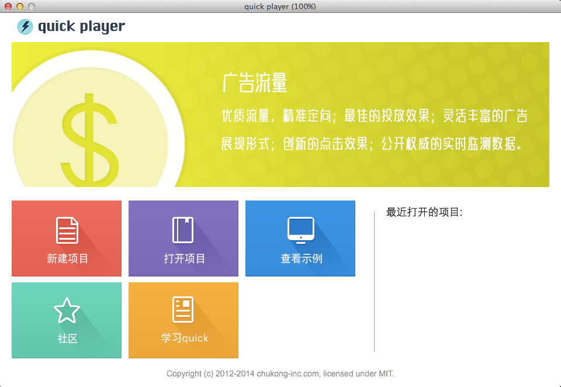

quick-cocos2d-x 是 cocos2d-x 开发商“[触控科技](http://www.chukong-inc.com/)”专门针对 Lua 开发者推出的扩展版本。

Quick-Cocos2d-x 基于 Cocos2d-x 开发，具有 Cocos2d-x 的所有优点。并在 Cocos2d-x 基础上添加了 Lua 脚本支持，和高级脚本框架。让开发商可以用更低的成本、更高的开发效率、更省的人力成本创造高品质手游产品。

**快速开发：** 框架自带手游需要的各种基础服务，开发商能够将有限的资源投入到产品的玩法和用户体验上。

**降低成本：** 选择 Quick-Cocos2d-x，整个产品的绝大部分代码都可以使用 Lua 脚本语言完成开发。相比 C++ 能够显著降低人员成本，在开发效率上也具有明显优势。

**优化用户体验：** Quick-Cocos2d-x 提供了更容易使用 UI 库和脚本编译打包加密和自动更新等功能。让开发商可以用更低的成本快速改善产品的体验。

**成熟可靠：** 目前使用 Cocos2d-x 平台开发的热门手游产品中，几乎一半都用到了 Lua 脚本语言。而 Quick-Cocos2d-x 作为 Cocos2d-x + Lua 的升级解决方案，保持了成熟可靠的特点。

-   quick-cocos2d-x 中文站 [http://quick.cocos.org/](http://quick.cocos.org/)
-   新浪微博 [http://weibo.com/quickcocos2dx](http://weibo.com/quickcocos2dx)
-   QQ 群 284148017, 243709595, 8952580
-   CSDN 镜像仓库（国内访问稳定快速），和 github 仓库同步，地址 [https://code.csdn.net/u014257247/quick-cocos2d-x](https://code.csdn.net/u014257247/quick-cocos2d-x)

~

## 快速开始

-   下载最新版 quick-cocos2d-x
-   运行 setup_mac.sh 或者 setup_win.bat
-   启动 player/mac/player.app 或者 player/win/player.exe

~

## 更进一步

-   [设置 quick-cocos2d-x 在 Mac 下的编译环境](docs/howto/setup_development_environment_on_mac/zh.html)
-   [设置 quick-cocos2d-x 在 Windows 下的编译环境](docs/howto/setup_development_environment_on_windows/zh.html)
-   [如何使用 proj.mac 和 proj.win32 工程](docs/howto/use-project-mac-and-win/zh.html)
-   [API 文档](docs/api/index.html)
-   [对 Lua 字节码进行加密](docs/howto/encrypt-lua-code/zh.md)
